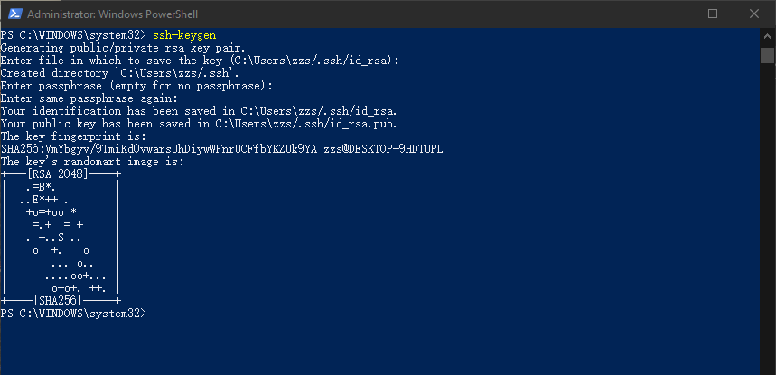

因为最近的项目需要部署到多台服务器上，如果一台一台的去操作的话，显然太费时费力了，由于公司又没有一整套完整的发布部署平台，所以我就自己写了个批处理脚本来实现项目的部署以及日志的拉取，这其中遇到过不少问题，所以就整理了两篇博客记录一下。

我们知道在管理服务器的时候，Linux/Mac系统下，使用ssh服务非常方便，然而生活中还有很多windows平台的服务器，如果也想使用的话，需要一些配置了。网上有说使用cygwin 来模拟UNIX 环境，但是这些太麻烦了，如果你是win10的话，那很幸运，微软现在已经支持OpenSSH了，可以直接拿来使用，本篇也只讲解win10下ssh的使用。

## 一、安装OpenSSH

默认的话，win10已经为我们安装好了OpenSSH客户端，只需要在服务器上安装服务端即可。

打开"设置"，按照以下步骤执行：

安装完成之后，我们会在系统服务中发现这两个ssh相关的服务：

其中，OpenSSH SSH Server是服务端需要开启的。OpenSSH Authentication Agent是客户端需要开启的，用于后面配置免密登录验证密钥用的。

验证：

这里我们就不安装XShell, cmder之类的命令行软件了，我们直接使用window自带的PowerShell这款强大的shell工具

我这里用我自己的电脑测试，可以看到能够使用了。

## 二、配置免密登录

使用ssh最重要的一步就是先要配置机器间的免密登录了吧，不然每次都要输入密码很麻烦，而且使自动运行脚本变得没有意义。

windows下配置免密登录跟Linux下差不多，稍微有点不同

#### 1.首先生成客户端公钥

比如我要客户端免密登录服务器，我首先在客户端执行以下命令，生成公钥

> ssh-keygen

执行命令后一路回车即可，全都选择默认目录，最后会在当前用户的主目录（C:\Users\用户名）下生成`.ssh`文件夹，里面包含了`id_rsa`和`id_rsa.pub`两个文件，`id_rsa.pub`即是我们需要的公钥。

#### 2.将客户端公钥加入服务端的配置中

首先我们查看服务端的`.ssh`目录下是否有`authorized_keys`该文件，当然默认是没有的，我们新建这个文件，然后将客户端公钥内容加进这个文件即可。

这里我是用文件传输命令scp

>  scp C:\Users\zzs\.ssh\id_rsa.pub zzs@127.0.0.1:D:\

这里先将文件拷贝到服务器D: 盘，然后再追加到该文件中

> cat D:\id_rsa.pub >> C:\Users\zzs\.ssh\authorized_keys

或者直接打开拷贝都行

#### 3.修改服务端配置文件

windows下的ssh的配置文件目录在`C:\ProgramData\ssh`下：（ssh安装目录在C:\Windows\System32\OpenSSH）

这里有我们ssh的配置文件`sshd_config`，我们打开它，注释掉最后两行即可：

#### 4.启动服务

在服务端启动上面说的`OpenSSH SSH Server`服务

在客户端启动`OpenSSH Authentication Agent`服务

#### 5.验证

至此，免密登录的配置已经完成，可以直接通过ssh进行访问而不需要输入密码了。