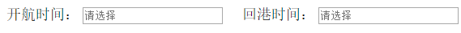
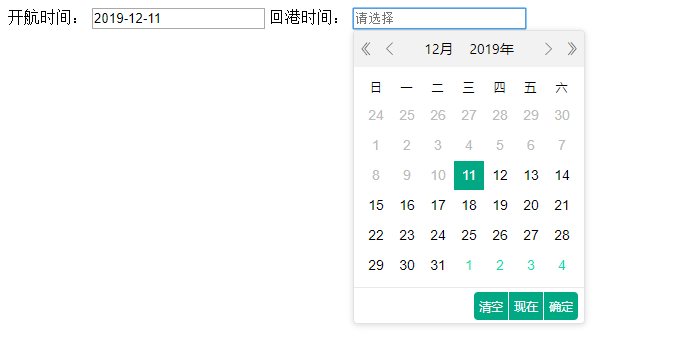
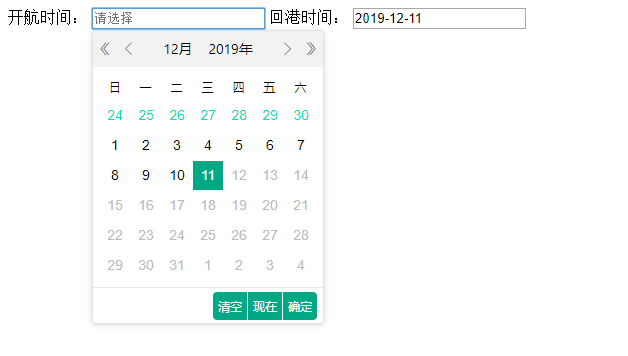

开发中常有这样一种需求，有两个日期选择框，比如一个开航时间，一个回港时间，如下图所示：



我们知道，回港时间肯定是在开航时间后面的，也就是说，当用户选择了某一个开航时间后，回港时间能选择的最小值应该大于或等于开航时间；又或者用户选择了某一个回港时间后，开航时间能选择的最大值应该小于或者等于回港时间。即实现两个日期控件的联动。

本篇文章采用jeDate日期控件，来实现两个日期控件间的联动。


jeDate日期控件的基本使用，这里就不介绍了，下面直接上代码：

#### 1.HTML页面

```html
<div>
    <span>开航时间：</span>
    <input id="startTime" style="cursor: pointer;" placeholder="请选择" readonly/>

    <span>回港时间：</span>
    <input id="endTime" style="cursor: pointer;" placeholder="请选择" readonly/>
</div>
```

#### 2.JS代码

```js
jeDate('#startTime', link1);// 实例化开航时间
jeDate('#endTime', link2);// 实例化回港时间
$('#startTime').val(getNow());// 这里要注意，如果你需要控件初始化的时候就显示当前日期，最好不要使用jeDate自带的那个参数，因为如果你有重置或者说清空这些日期控件的操作，这个时候先选择回港时间会自动把开航时间赋值为今天

function link1(istg) {
    return {
        trigger: istg || "click",
        format: 'YYYY-MM-DD',
        //isinitVal: true,
        onClose: false,
        maxDate: function (obj) {
            var nowMinDate = jeDate.valText('#endTime') == "";
            return nowMinDate ? "2099-12-31" : jeDate.valText('#endTime');
        },
        donefun: function (obj) {
            jeDate("#endTime", link2(false));
        }
    };
}

function link2(istg) {
    return {
        trigger: istg || "click",
        format: 'YYYY-MM-DD',
        onClose: false,
        minDate: function (that) {
            var nowMinDate = jeDate.valText('#startTime') == "";
            return nowMinDate ? "1900-01-01" : jeDate.valText('#startTime');
        },
        donefun: function (obj) {
            jeDate("#startTime", link1(false));
        }
    };
}

// 获取今天的日期
function getNow() {
    var now = new Date();
    var year = now.getFullYear();
    var month = now.getMonth();
    var date = now.getDate();
    month = month + 1;
    if (month < 10) month = "0" + month;
    if (date < 10) date = "0" + date;
    return year + "-" + month + "-" + date;
}
```

上面需要初始化时间那里需要注意一下。

然后我们可以看出来，最主要的就是实例化日期控件中的 `doneFun` 函数，表示选中完日期后进行的回调，这里是去执行另外一个日期控件的初始化操作，然后通过获取前一个日期控件的时间来限定当前日期控件的可选范围。


#### 效果：





可以看到，选择一个日期后，另外一个控件的可选范围已经变了。