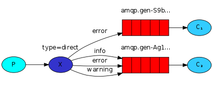

**一、简介**

**1、什么是RabbitMQ**

RabbitMQ是一个开源的消息代理和队列服务器，用来通过普通协议在完全不同的应用之间共享数据，RabbitMQ是使用Erlang语言来编写的，并且RabbitMQ是基于 AMQP协议的。

**2、AMQP协议模型**


**3、几个概念**

Server：又称Broker（实体服务） 接收客户端的连接。实现AMQP实体服务

Virtual host：虚拟地址，用于进行逻辑隔离，最上层的消息路由。一个Virtual host里面可以有若干个Exchange和Queue，同一个Virtual host里面不能有相同名称的Exchange或Queue（用于隔离不同的项目和应用的）

Exchange：交换机，接收消息，根据路由键转发消息到绑定的队列

Queue：也称为Message Queue,消息队列，保存消息并将它们转发给消费者，消费者直接监听队列就能收到消息了

**4、交换机类型**

fanout：它会把发送到该Exchange的消息路由到所有与它绑定的Queue中。


direct：它会把消息路由到那些binding key与routing key完全匹配的Queue中。



如上图，若发送routingKey为error的消息，则会发送到这两个交换机；而如果发送info或者warning类型的消息，则只发送到下面一个交换机。


topic：类似于direct类型的交换机，只不过direct是完全匹配的，topic支持模糊匹配。支持两种特殊字符“\*”与“\#”，用于做模糊匹配，其中“\*”用于匹配一个单词，“\#”用于匹配多个单词（可以是零个）。

注意：RabbitMQ中，模糊匹配必须以小数点分隔，如test.\* 或test.\*.abc或test.\#或test.\#.abc，不支持 test\*，也不支持test.\*abc


headers：根据发送的消息内容中的headers属性进行匹配。(不常用)


**二、使用**

**1.SpringBoot整合RabbitMQ**

(SpringBoot版本1.5.20.RELEAS)

1.1添加依赖	

```
<dependency>
    <groupId>org.springframework.boot</groupId>
    <artifactId>spring-boot-starter-amqp</artifactId>
</dependency>
```

1.2添加MQ配置

```
spring.rabbitmq.host=localhost
spring.rabbitmq.port=5672
spring.rabbitmq.username=guest
spring.rabbitmq.password=guest
#spring.rabbitmq.virtual-host=/test
```

1.3编写MQ配置类

```java
import org.springframework.amqp.core.Queue;
import org.springframework.context.annotation.Bean;
import org.springframework.context.annotation.Configuration;

/**
 * @author zzs
 * @date 2019/7/9 21:09
 */
@Configuration
public class RabbitConfig {

    /**
     * 定义队列名
     */
    private final static String STRING = "str";


    /**
     * 定义str队列
     *
     * @return
     */
    @Bean
    public Queue string() {
        return new Queue(STRING);

    }
}
```

1.4编写生产者

```java
import org.springframework.amqp.core.AmqpTemplate;
import org.springframework.beans.factory.annotation.Autowired;
import org.springframework.stereotype.Component;

import java.text.SimpleDateFormat;
import java.util.Date;

/**
 * @author zzs
 * @date 2019/7/9 21:10
 */
@Component
public class RabbitProducer {

    @Autowired
    private AmqpTemplate rabbitTemplate;

    public void send() {
        Date date = new Date();
        String dateString = new SimpleDateFormat("yyyy-MM-dd HH:mm:ss.SSS").format(date);
        System.out.println("[str] send msg:" + dateString);

        // 第一个参数为刚刚定义的队列名称
        this.rabbitTemplate.convertAndSend("str", dateString);
    }
}
```


1.5编写消费者

```java
import org.springframework.amqp.rabbit.annotation.RabbitHandler;
import org.springframework.amqp.rabbit.annotation.RabbitListener;
import org.springframework.stereotype.Component;

/**
 * @author zzs
 * @date 2019/7/9 21:12
 */
@Component
@RabbitListener(queues = "str")
public class RabbitConsumer {


    /**
     * 消息消费
     *
     * @RabbitHandler 代表此方法为接受到消息后的处理方法
     */
    @RabbitHandler
    public void received(String msg) {
        System.out.println("[str] received message:" + msg);
    }

}
```


1.6编写测试类

```java
import org.junit.Test;
import org.junit.runner.RunWith;
import org.springframework.beans.factory.annotation.Autowired;
import org.springframework.boot.test.context.SpringBootTest;
import org.springframework.test.context.junit4.SpringRunner;

/**
 * @author zzs
 * @date 2019/7/9 21:14
 */
@RunWith(SpringRunner.class)
@SpringBootTest
public class RabbitApplication {

    @Autowired
    private RabbitProducer producer;

    @Test
    public void testStringSend() {
        for (int i = 0; i < 5; i++) {
            producer.send();
        }
    }
}
```


至此，一个简单的mq测试已经完成。


> **高级使用**

**Topic Exchange**

topic 是 RabbitMQ 中最灵活的一种方式，可以根据 routing_key 自由的绑定不同的队列

①.编写配置类，声明队列、交换机、以及队列和交换机的绑定关系

```java
import org.springframework.amqp.core.Binding;
import org.springframework.amqp.core.BindingBuilder;
import org.springframework.amqp.core.Queue;
import org.springframework.amqp.core.TopicExchange;
import org.springframework.context.annotation.Bean;
import org.springframework.context.annotation.Configuration;

/**
 * @author zzs
 * @date 2019/7/9 22:27
 */
@Configuration
public class TopicRabbitConfig {

    @Bean
    public Queue topicQueueA() {
        return new Queue("topic.message");
    }

    @Bean
    public Queue topicQueueB() {
        return new Queue("topic.message2");
    }

    @Bean
    public TopicExchange topicExchange() {
        return new TopicExchange("TopicExchange");
    }

    @Bean
    public Binding bindingExchangeMessage(Queue topicQueueA, TopicExchange topicExchange) {
        return BindingBuilder.bind(topicQueueA).to(topicExchange).with("topic.message");
    }

    @Bean
    public Binding bindingExchangeMessages(Queue topicQueueB, TopicExchange topicExchange) {
        return BindingBuilder.bind(topicQueueB).to(topicExchange).with("topic.#");
    }
}
```

②.编写生产者

```java
import org.springframework.amqp.core.AmqpTemplate;
import org.springframework.beans.factory.annotation.Autowired;
import org.springframework.stereotype.Component;

/**
 * @author zzs
 * @date 2019/7/9 22:30
 */
@Component
public class TopicRabbitProducer {

    @Autowired
    private AmqpTemplate rabbitTemplate;

    public void send1() {

        String context = "hello, this is message 1";
        System.out.println("Sender : " + context);
        this.rabbitTemplate.convertAndSend("TopicExchange", "topic.message", context);
    }

    public void send2() {
        String context = "hello, this is message 2";
        System.out.println("Sender : " + context);
        this.rabbitTemplate.convertAndSend("TopicExchange", "topic.message2", context);
    }
}
```

最终，message1被发送到队列1和队列2，而message2被发送到队列2


**Fanout Exchange**

Fanout 就是我们熟悉的广播模式或者订阅模式，给 Fanout 交换机发送消息，绑定了这个交换机的所有队列都收到这个消息。

①.编写配置类

```java
import org.springframework.amqp.core.Binding;
import org.springframework.amqp.core.BindingBuilder;
import org.springframework.amqp.core.FanoutExchange;
import org.springframework.amqp.core.Queue;
import org.springframework.context.annotation.Bean;
import org.springframework.context.annotation.Configuration;

/**
 * @author zzs
 * @date 2019/7/9 22:42
 */
@Configuration
public class FanoutRabbitConfig {

    @Bean
    public Queue fanoutQueueA() {
        return new Queue("fanout.A");
    }

    @Bean
    public Queue fanoutQueueB() {
        return new Queue("fanout.B");
    }

    @Bean
    public Queue fanoutQueueC() {
        return new Queue("fanout.C");
    }

    @Bean
    public FanoutExchange fanoutExchange() {
        return new FanoutExchange("FanoutExchange");
    }

    @Bean
    public Binding bindingExchangeA(Queue fanoutQueueA, FanoutExchange fanoutExchange) {
        return BindingBuilder.bind(fanoutQueueA).to(fanoutExchange);
    }

    @Bean
    public Binding bindingExchangeB(Queue fanoutQueueB, FanoutExchange fanoutExchange) {
        return BindingBuilder.bind(fanoutQueueB).to(fanoutExchange);
    }

    @Bean
    public Binding bindingExchangeC(Queue fanoutQueueC, FanoutExchange fanoutExchange) {
        return BindingBuilder.bind(fanoutQueueC).to(fanoutExchange);
    }
}
```

②.编写生产者

```java
import org.springframework.amqp.core.AmqpTemplate;
import org.springframework.beans.factory.annotation.Autowired;

/**
 * @author zzs
 * @date 2019/7/9 22:44
 */
public class FanoutRabbitProducer {

    @Autowired
    private AmqpTemplate rabbitTemplate;

    public void send() {
        String context = "hello, this is message";
        System.out.println("Sender : " + context);
        this.rabbitTemplate.convertAndSend("FanoutExchange", "", context);
    }
}
```

这里使用了 A、B、C 三个队列绑定到 Fanout 交换机上面，发送端的 routing_key 写任何字符都会被忽略


**Direct Exchange**

直连交换机

①.编写配置类

```java
import org.springframework.amqp.core.Binding;
import org.springframework.amqp.core.BindingBuilder;
import org.springframework.amqp.core.DirectExchange;
import org.springframework.amqp.core.Queue;
import org.springframework.context.annotation.Bean;
import org.springframework.context.annotation.Configuration;

/**
 * @author zzs
 * @date 2019/7/9 22:51
 */
@Configuration
public class DirectRabbitConfig {

    @Bean
    public Queue directQueue() {
        return new Queue("direct.message");
    }


    @Bean
    public DirectExchange directExchange() {
        return new DirectExchange("DirectExchange");
    }

    @Bean
    public Binding bindingExchangeMessage() {
        return BindingBuilder.bind(directQueue()).to(directExchange()).with("direct.route.key");
    }
}
```

②.编写生产者

```java
import org.springframework.amqp.core.AmqpTemplate;
import org.springframework.beans.factory.annotation.Autowired;
import org.springframework.stereotype.Component;

/**
 * @author zzs
 * @date 2019/7/9 22:30
 */
@Component
public class DirectRabbitProducer {

    @Autowired
    private AmqpTemplate rabbitTemplate;

    public void send() {
        String context = "hello, this is message";
        System.out.println("Sender : " + context);
        this.rabbitTemplate.convertAndSend("DirectExchange", "direct.route.key", context);
    }
}
```


**2.Spring使用RabbitMQ**（xml方式）

①.maven添加依赖

```xml
<!-- json -->
<dependency>
    <groupId>com.alibaba</groupId>
    <artifactId>fastjson</artifactId>
    <version>1.2.56</version>
</dependency>

<dependency>
    <groupId>com.fasterxml.jackson.core</groupId>
    <artifactId>jackson-databind</artifactId>
    <version>2.9.9</version>
</dependency>
<dependency>
    <groupId>com.fasterxml.jackson.core</groupId>
    <artifactId>jackson-core</artifactId>
    <version>2.9.9</version>
</dependency>
<dependency>
    <groupId>com.fasterxml.jackson.core</groupId>
    <artifactId>jackson-annotations</artifactId>
    <version>2.9.9</version>
</dependency>

<!-- rabbit mq -->
<dependency>
    <groupId>org.springframework.amqp</groupId>
    <artifactId>spring-rabbit</artifactId>
    <version>2.1.5.RELEASE</version>
</dependency>
```


②.在classpath下增加rabbitMQ的配置文件spring-rabbit.xml和spring-rabbit-listener.xml，并将这两个文件导入applicationContext.xml中。

spring-rabbit.xml内容如下：

```xml
<?xml version="1.0" encoding="UTF-8"?>
<beans xmlns="http://www.springframework.org/schema/beans"
       xmlns:xsi="http://www.w3.org/2001/XMLSchema-instance"
       xmlns:rabbit="http://www.springframework.org/schema/rabbit"
       xsi:schemaLocation="http://www.springframework.org/schema/beans
         http://www.springframework.org/schema/beans/spring-beans.xsd
       http://www.springframework.org/schema/rabbit
       http://www.springframework.org/schema/rabbit/spring-rabbit.xsd">


    <!-- main vhost 连接工厂 -->
    <rabbit:connection-factory
            id="mainConnectionFactory"
            addresses="127.0.0.1:5672"
            virtual-host="main"
            username="guest"
            password="guest"
            cache-mode="CHANNEL"
            channel-cache-size="10"
            connection-timeout="3000"
    />

    <!-- test vhost 连接工厂 -->
    <rabbit:connection-factory
            id="testConnectionFactory"
            addresses="127.0.0.1:5672"
            virtual-host="test"
            username="guest"
            password="guest"
            cache-mode="CHANNEL"
            channel-cache-size="10"
            connection-timeout="3000"
    />

    <!-- main vhost 管理器 -->
    <rabbit:admin id="mainAdmin" connection-factory="mainConnectionFactory"/>
    <!-- test vhost 管理器 -->
    <rabbit:admin id="testAdmin" connection-factory="testConnectionFactory"/>

    <!-- JSON 消息转换器 -->
    <bean id="jsonMessageConverter" class="org.springframework.amqp.support.converter.Jackson2JsonMessageConverter"/>

    <!-- ================= direct类型交换机 ================= -->
    <rabbit:direct-exchange name="DirectExchange" declared-by="testAdmin" auto-declare="true" auto-delete="false" durable="true">
        <rabbit:bindings>

            <rabbit:binding key="direct.message.1" queue="direct.queue.1"/>
            <rabbit:binding key="direct.message.2" queue="direct.queue.2"/>

        </rabbit:bindings>
    </rabbit:direct-exchange>

    <rabbit:template id="directMQTemplate" connection-factory="testConnectionFactory" exchange="DirectExchange" message-converter="jsonMessageConverter"/>


    <!-- ================= topic类型交换机 ================= -->
    <rabbit:topic-exchange name="TopicExchange" declared-by="mainAdmin" auto-declare="true" auto-delete="false" durable="true">
        <rabbit:exchange-arguments/>
        <rabbit:bindings>

            <rabbit:binding pattern="topic.message.1" queue="topic.queue.1"/>
            <rabbit:binding pattern="topic.message.2.#" queue="topic.queue.2"/>
            <rabbit:binding pattern="topic.message.3.*" queue="topic.queue.3"/>

        </rabbit:bindings>
    </rabbit:topic-exchange>

    <rabbit:template id="topicMQTemplate" connection-factory="mainConnectionFactory" exchange="TopicExchange" message-converter="jsonMessageConverter"/>


    <!-- =========================== message queue =========================== -->
    <rabbit:queue name="direct.queue.1" declared-by="testAdmin" auto-declare="true" auto-delete="false" durable="true" exclusive="false">
        <rabbit:queue-arguments>
            <entry key="x-max-length" value="1000000" value-type="java.lang.Long"/>
            <entry key="x-max-length-bytes" value="300485760" value-type="java.lang.Long"/>
        </rabbit:queue-arguments>
    </rabbit:queue>

    <rabbit:queue name="direct.queue.2" declared-by="testAdmin" auto-declare="true" auto-delete="false" durable="true" exclusive="false">
        <rabbit:queue-arguments>
            <entry key="x-max-length" value="1000000" value-type="java.lang.Long"/>
            <entry key="x-max-length-bytes" value="300485760" value-type="java.lang.Long"/>
        </rabbit:queue-arguments>
    </rabbit:queue>

    <rabbit:queue name="topic.queue.1" declared-by="mainAdmin" auto-declare="true" auto-delete="false" durable="true" exclusive="false">
        <rabbit:queue-arguments>
            <entry key="x-max-length" value="1000000" value-type="java.lang.Long"/>
            <entry key="x-max-length-bytes" value="300485760" value-type="java.lang.Long"/>
        </rabbit:queue-arguments>
    </rabbit:queue>

    <rabbit:queue name="topic.queue.2" declared-by="mainAdmin" auto-declare="true" auto-delete="false" durable="true" exclusive="false">
        <rabbit:queue-arguments>
            <entry key="x-max-length" value="1000000" value-type="java.lang.Long"/>
            <entry key="x-max-length-bytes" value="300485760" value-type="java.lang.Long"/>
        </rabbit:queue-arguments>
    </rabbit:queue>

    <rabbit:queue name="topic.queue.3" declared-by="mainAdmin" auto-declare="true" auto-delete="false" durable="true" exclusive="false">
        <rabbit:queue-arguments>
            <entry key="x-max-length" value="1000000" value-type="java.lang.Long"/>
            <entry key="x-max-length-bytes" value="300485760" value-type="java.lang.Long"/>
        </rabbit:queue-arguments>
    </rabbit:queue>

</beans>
```

spring-rabbit-listener.xml内容如下：

```xml
<?xml version="1.0" encoding="UTF-8"?>
<beans xmlns="http://www.springframework.org/schema/beans"
       xmlns:xsi="http://www.w3.org/2001/XMLSchema-instance"
       xmlns:rabbit="http://www.springframework.org/schema/rabbit"
       xsi:schemaLocation="http://www.springframework.org/schema/beans
         http://www.springframework.org/schema/beans/spring-beans.xsd
       http://www.springframework.org/schema/rabbit
       http://www.springframework.org/schema/rabbit/spring-rabbit.xsd">

    <bean id="pushMQListener" class="com.example.demo.mq.rabbit.spring.PushMQListener"/>

    <rabbit:listener-container connection-factory="testConnectionFactory" acknowledge="auto" message-converter="jsonMessageConverter">
        <rabbit:listener queue-names="direct.queue.1" ref="pushMQListener" method="onDirectMessage1"/>
        <rabbit:listener queue-names="direct.queue.2" ref="pushMQListener" method="onDirectMessage2"/>
    </rabbit:listener-container>

    <rabbit:listener-container connection-factory="mainConnectionFactory" acknowledge="auto" message-converter="jsonMessageConverter">
        <rabbit:listener queue-names="topic.queue.1" ref="pushMQListener" method="onTopicMessage1"/>
        <rabbit:listener queue-names="topic.queue.2" ref="pushMQListener" method="onTopicMessage2"/>
        <rabbit:listener queue-names="topic.queue.3" ref="pushMQListener" method="onTopicMessage3"/>
    </rabbit:listener-container>

</beans>
```


③.编写监听器（消费者）

```java
/**
 * @author zzs
 * @date 2019/7/10 20:51
 */
public class PushMQListener {

    public void onDirectMessage1(String message) {
        System.out.println("[DirectMessage1] Received -> " + message);
    }

    public void onDirectMessage2(String message) {
        System.out.println("[DirectMessage2] Received -> " + message);
    }

    public void onTopicMessage1(String message) {
        System.out.println("[TopicMessage1] Received -> " + message);
    }

    public void onTopicMessage2(String message) {
        System.out.println("[TopicMessage2] Received -> " + message);
    }

    public void onTopicMessage3(String message) {
        System.out.println("[TopicMessage3] Received -> " + message);
    }

}
```


④.测试

```java
import com.alibaba.fastjson.JSON;
import org.springframework.amqp.core.AmqpTemplate;
import org.springframework.boot.SpringApplication;
import org.springframework.boot.autoconfigure.SpringBootApplication;
import org.springframework.boot.autoconfigure.amqp.RabbitAutoConfiguration;
import org.springframework.boot.autoconfigure.data.redis.RedisAutoConfiguration;
import org.springframework.boot.autoconfigure.data.redis.RedisRepositoriesAutoConfiguration;
import org.springframework.boot.autoconfigure.jdbc.DataSourceAutoConfiguration;
import org.springframework.context.ConfigurableApplicationContext;
import org.springframework.context.annotation.ImportResource;
import org.springframework.context.annotation.PropertySource;

@SpringBootApplication(exclude = {DataSourceAutoConfiguration.class,
        RedisAutoConfiguration.class,
        RedisRepositoriesAutoConfiguration.class,
        RabbitAutoConfiguration.class})
@ImportResource(locations = {"classpath:applicationContext.xml"})
@PropertySource(value = {"classpath:config.properties"}, ignoreResourceNotFound = true)
public class SingleDemoApplication {

    public static void main(String[] args) {
        ConfigurableApplicationContext context = SpringApplication.run(SingleDemoApplication.class, args);

        AmqpTemplate directMQTemplate = context.getBean("directMQTemplate", AmqpTemplate.class);
        AmqpTemplate topicMQTemplate = context.getBean("topicMQTemplate", AmqpTemplate.class);

        directMQTemplate.convertAndSend("direct.message.1",JSON.toJSONString("hello, this is message from rabbit"));
        directMQTemplate.convertAndSend("direct.message.2",JSON.toJSONString("hello, this is message from rabbit"));


        topicMQTemplate.convertAndSend("topic.message.1",JSON.toJSONString("hello, this is message from rabbit"));
        topicMQTemplate.convertAndSend("topic.message.2.test.123",JSON.toJSONString("hello, this is message from rabbit"));
        topicMQTemplate.convertAndSend("topic.message.3.test",JSON.toJSONString("hello, this is message from rabbit"));
    }
}
```


**三、RabbitMQ消息可靠性**


①： 首先把消息信息(要发送的数据）存储到数据库中，再把这个消息记录也存储到一张消息记录表里

②：发送消息到MQ Broker节点（采用confirm方式发送，会有异步的返回结果）

③、④：生产者端接受MQ Broker节点返回的Confirm确认消息结果，然后进行更新消息记录表里的消息状态。比如默认Status = 0 （发送中）当收到消息确认成功后，更新为1即可！

⑤：但是在消息确认这个过程中可能由于网络闪断、MQ Broker端异常等原因导致 回送消息失败或者异常。这个时候就需要发送方（生产者）对消息进行可靠性投递了，保障消息不丢失，100%的投递成功！（有一种极限情况是闪断，Broker返回的成功确认消息，但是生产端由于网络闪断没收到，这个时候重新投递可能会造成消息重复，需要消费端去做幂等处理）所以我们需要有一个定时任务，（比如每5分钟拉取一下处于中间状态的消息，当然这个消息可以设置一个超时时间，比如超过1分钟 Status = 0 ，也就说明了1分钟这个时间窗口内，我们的消息没有被确认，那么会被定时任务拉取出来）

⑥：接下来我们把中间状态的消息进行重新投递 retry send，继续发送消息到MQ ，当然也可能有多种原因导致发送失败

⑦：我们可以采用设置最大努力尝试次数，比如投递了3次，还是失败，那么我们可以将最终状态设置为Status = 2 ，最后 交由人工解决处理此类问题（或者把消息转储到失败表中）。


_参考文章：_

https://www.imooc.com/article/49814