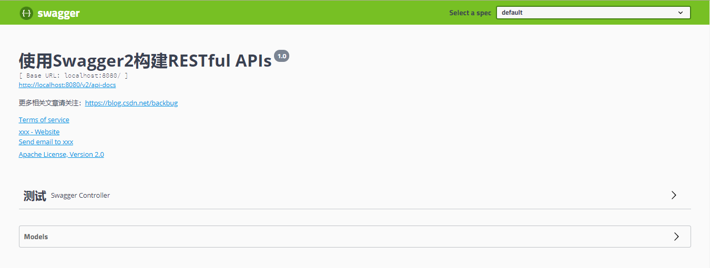
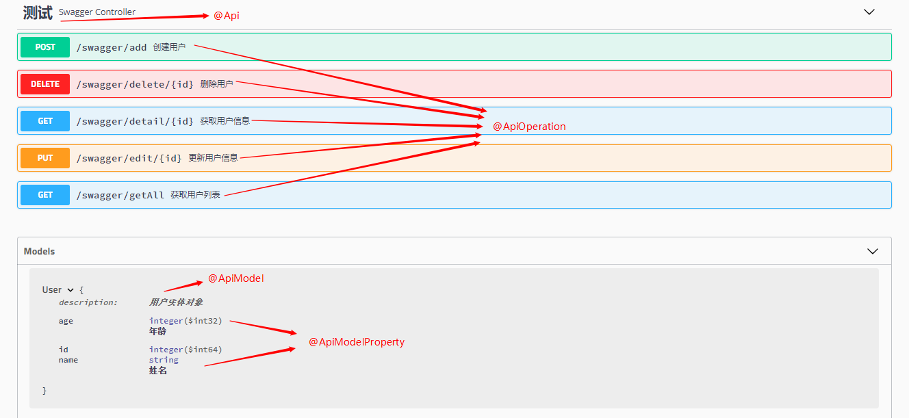
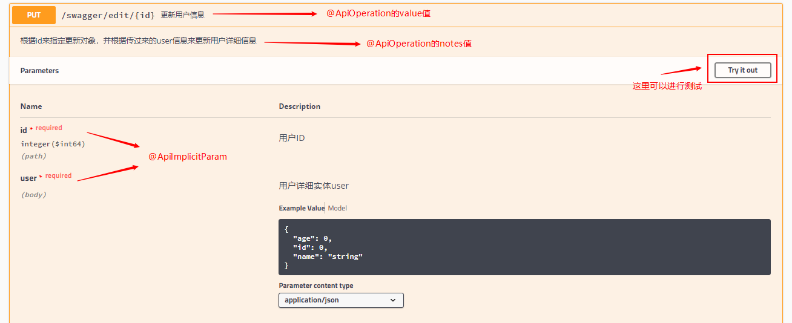

## 简介

​		随着前后端分离架构和微服务架构的流行，我们使用Spring Boot来构建RESTful API项目的场景越来越多。通常我们的一个RESTful API就有可能要服务于多个不同的开发人员或开发团队：IOS开发、Android开发、Web开发甚至其他的后端服务等。为了减少与其他团队平时开发期间的频繁沟通成本，传统做法就是创建一份RESTful API文档来记录所有接口细节，然而这样的做法有以下几个问题：

- 由于接口众多，并且细节复杂（需要考虑不同的HTTP请求类型、HTTP头部信息、HTTP请求内容等），高质量地创建这份文档本身就是件非常吃力的事，下游的抱怨声不绝于耳。
- 随着时间推移，不断修改接口实现的时候都必须同步修改接口文档，而文档与代码又处于两个不同的媒介，除非有严格的管理机制，不然很容易导致不一致现象。

​		为了解决上面这样的问题，本文将介绍RESTful API的重磅好伙伴Swagger2，它可以轻松的整合到Spring Boot中，并与Spring MVC程序配合组织出强大RESTful API文档。它既可以减少我们创建文档的工作量，同时说明内容又整合入实现代码中，让维护文档和修改代码整合为一体，可以让我们在修改代码逻辑的同时方便的修改文档说明。另外Swagger2也提供了强大的页面测试功能来调试每个RESTful API。

 具体效果如下图所示： 



## 使用

#### 1.添加Swagger依赖

```xml
<dependency>
    <groupId>io.springfox</groupId>
    <artifactId>springfox-swagger2</artifactId>
    <version>2.9.2</version>
</dependency>
<dependency>
    <groupId>io.springfox</groupId>
    <artifactId>springfox-swagger-ui</artifactId>
    <version>2.9.2</version>
</dependency>
```

#### 2.添加配置类

```java
import org.springframework.context.annotation.Bean;
import org.springframework.context.annotation.Configuration;
import springfox.documentation.builders.ApiInfoBuilder;
import springfox.documentation.builders.PathSelectors;
import springfox.documentation.builders.RequestHandlerSelectors;
import springfox.documentation.service.ApiInfo;
import springfox.documentation.service.Contact;
import springfox.documentation.spi.DocumentationType;
import springfox.documentation.spring.web.plugins.Docket;
import springfox.documentation.swagger2.annotations.EnableSwagger2;

@EnableSwagger2
@Configuration
public class Swagger2 {

    @Bean
    public Docket createRestApi() {
        return new Docket(DocumentationType.SWAGGER_2)
                .apiInfo(apiInfo())
                .select()
                .apis(RequestHandlerSelectors.basePackage("com.example.demo.web.swagger"))
                .paths(PathSelectors.any())
                .build();
    }

    /** 用来创建该Api的基本信息（这些基本信息会展现在文档页面中） **/
    private ApiInfo apiInfo() {
        return new ApiInfoBuilder()
                .title("使用Swagger2构建RESTful APIs")
                .description("更多相关文章请关注：https://blog.csdn.net/backbug")
                .termsOfServiceUrl("https://swagger.io/")
                .license("Apache License, Version 2.0")
                .licenseUrl("https://www.apache.org/licenses/LICENSE-2.0.html")
                .contact(new Contact("xxx","https://www.baidu.com","xxx@xxx.xxx"))
                .version("1.0")
                .build();
    }
}

```


至此，前期准备工作已经完成。下面开始使用

#### 3.添加文档内容

在完成了上述配置后，其实已经可以生产文档内容，访问 http://localhost:8080/swagger-ui.html 即可看到，但是描述对用户并不友好，我们通常需要自己增加一些说明来丰富文档内容。  我们通过`@Api`，`@ApiOperation`注解来给API增加说明、通过`@ApiImplicitParam`、`@ApiModel`、`@ApiModelProperty`注解来给参数增加说明。 

①实体对象：

```java
import io.swagger.annotations.ApiModel;
import io.swagger.annotations.ApiModelProperty;
import lombok.Data;

@ApiModel(description = "用户实体对象")
@Data
public class User {

    private Long id;

    @ApiModelProperty(value = "姓名")
    private String name;

    @ApiModelProperty(value = "年龄")
    private Integer age;

    /** 表示api中不展示此字段 **/
    @ApiModelProperty(hidden = true)
    private String mobile;
}
```

②Controller层的使用

```java
import io.swagger.annotations.Api;
import io.swagger.annotations.ApiImplicitParam;
import io.swagger.annotations.ApiImplicitParams;
import io.swagger.annotations.ApiOperation;
import org.springframework.web.bind.annotation.*;
import springfox.documentation.annotations.ApiIgnore;

import java.util.ArrayList;
import java.util.List;

@Api(tags = {"测试"})
@RequestMapping("/swagger")
@RestController
public class SwaggerController {

    @ApiOperation(value = "获取用户列表", notes = "")
    @GetMapping("/getAll")
    public List<User> getUserList() {
        return new ArrayList<>();
    }

    /**
     * paramType：参数放在哪个地方
     * · header --> 请求参数的获取：@RequestHeader
     * · query --> 请求参数的获取：@RequestParam
     * · path（用于restful接口）--> 请求参数的获取：@PathVariable
     * · body
     * · form
     */
    @ApiOperation(value = "创建用户", notes = "根据User对象创建用户")
    @ApiImplicitParam(name = "user", value = "用户详细实体user", required = true, dataType = "User", paramType = "body")
    @PostMapping("/add")
    public String add(@RequestBody User user) {
        System.err.println(user);
        return "success";
    }

    @ApiOperation(value = "获取用户信息", notes = "根据id来获取用户详细信息")
    @ApiImplicitParam(name = "id", value = "用户ID", required = true, dataType = "Long", paramType = "path", example = "1")
    @GetMapping("/detail/{id}")
    public User detail(@PathVariable Long id) {
        System.err.println(id);
        return new User();
    }

    @ApiOperation(value = "更新用户信息", notes = "根据id来指定更新对象，并根据传过来的user信息来更新用户详细信息")
    @ApiImplicitParams({
            @ApiImplicitParam(name = "id", value = "用户ID", required = true, dataType = "Long", paramType = "path", example = "1"),
            @ApiImplicitParam(name = "user", value = "用户详细实体user", required = true, dataType = "User", paramType = "body")
    })
    @PutMapping("/edit/{id}")
    public String edit(@PathVariable Long id, @RequestBody User user) {
        System.err.println(id);
        System.err.println(user);
        return "success";
    }

    @ApiOperation(value = "删除用户", notes = "根据id来指定删除对象")
    @ApiImplicitParam(name = "id", value = "用户ID", required = true, dataType = "Long", paramType = "path", example = "1")
    @DeleteMapping("/delete/{id}")
    public String delete(@PathVariable Long id) {
        System.err.println(id);
        return "success";
    }

    @ApiIgnore
    @GetMapping("/test")
    public String test() {
        return "success";
    }
}
```

③页面效果

访问 [http://localhost:8080/swagger-ui.html]()查看api信息





 相比为这些接口编写文档的工作，我们增加的配置内容是非常少而且精简的，对于原有代码的侵入也在忍受范围之内。因此，在构建RESTful API的同时，加入Swagger来对API文档进行管理，是个不错的选择。 


----

### 拓展

如果觉得上边的配置还是有点麻烦的话，这里提供另外一个开源项目：

[ https://github.com/SpringForAll/spring-boot-starter-swagger ]()

这里和springboot集成好了

#### 使用方式：

添加依赖：

```xml
<dependency>
    <groupId>com.spring4all</groupId>
    <artifactId>swagger-spring-boot-starter</artifactId>
    <version>1.9.0.RELEASE</version>
</dependency>
```

添加相关配置信息：

```properties
### spring4all - Swagger
### 使用注解@EnableSwagger2Doc
swagger.title=使用Swagger2构建RESTful APIs
swagger.description=更多相关文章请关注：https://blog.csdn.net/backbug
swagger.version=1.0
swagger.license=Apache License, Version 2.0
swagger.licenseUrl=https://www.apache.org/licenses/LICENSE-2.0.html
swagger.termsOfServiceUrl=https://github.com/dyc87112/spring-boot-starter-swagger
swagger.contact.name=xxx
swagger.contact.url=https://www.baidu.com
swagger.contact.email=xxx@xxx.xxx
swagger.base-package=com.example.demo
swagger.base-path=/**
```

各个属性说明：

- swagger.title`：标题
- `swagger.description`：描述
- `swagger.version`：版本
- `swagger.license`：许可证
- `swagger.licenseUrl`：许可证URL
- `swagger.termsOfServiceUrl`：服务条款URL
- `swagger.contact.name`：维护人
- `swagger.contact.url`：维护人URL
- `swagger.contact.email`：维护人email
- `swagger.base-package`：swagger扫描的基础包，默认：全扫描
- `swagger.base-path`：需要处理的基础URL规则，默认：/**

此时准备工作已经完成，可以在项目中使用了，同上。


_参考_

[ https://mp.weixin.qq.com/s/HlTZp1yfspQ0v1v63udpag ]()

